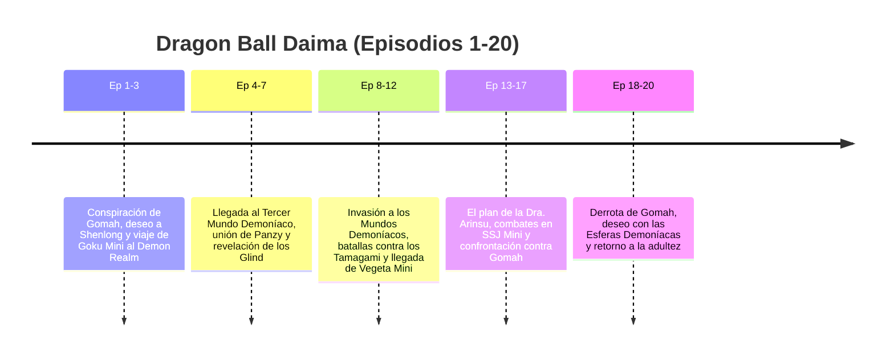

# Guía Hiperdetallada Episodio por Episodio: Dragon Ball Daima (Episodios 1 al 20)

Esta enciclopedia analiza los **20 episodios individuales** de *Dragon Ball Daima* (creado por Akira Toriyama / Toei Animation), desglosando para cada capítulo el **Villano / Antagonista** y el **Hito / Transformación / Evento Histórico**.

---

## ESTRUCTURA NARRATIVA DE DRAGON BALL DAIMA (EPISODIOS 1 A 20)

---

## DESGLOSE CAPÍTULO POR CAPÍTULO

* **Episodio 1: Conspiración**
  * *Villanos:* Rey Gomah y Degesu.
  * *Hito:* Gomah observa la derrota de Majin Buu en pantallas mágicas tras la muerte de Dabra; viaja a la Tierra junto a Degesu y pide a Shenlong convertir a Goku y a todos los que combatieron contra Buu en **niños (versiones Mini)**.
* **Episodio 2: Glorio**
  * *Villano:* Rey Gomah / Glorio (intenciones ambiguas).
  * *Hito:* Goku Mini viaja a la Kame House a recuperar el **Báculo Sagrado (Nyoibo)**; conoce a **Glorio**, un astuto piloto del Tercer Reino Demoníaco que llega en nave para ofrecer llevar a Goku y Shin Mini al Demon Realm.
* **Episodio 3: Viaje**
  * *Villanos:* Criaturas salvajes interdimensionales.
  * *Hito:* Goku Mini, Shin Mini y Glorio cruzan el portal dimensional *Warp Hole*, ingresando oficialmente al **Reino Demoníaco (Demon Realm)**.
* **Episodio 4: Tecnociudad**
  * *Villanos:* Oficiales demoníacos de aduana.
  * *Hito:* Llegada al Tercer Mundo Demoníaco; la nave sufre un desperfecto; Goku debe adaptarse a la densidad del aire pesado del reino y compran suministros en la Tecnociudad.
* **Episodio 5: Panzy**
  * *Villanos:* Guardia Real Demoníaca.
  * *Hito:* Conocen a la joven princesa demonio **Panzy** (hija del Rey Kadam), quien se une a la expedición como mecánica e instructora geográfica del grupo.
* **Episodio 6: El Primer Tamagami**
  * *Villano:* Tamagami N°1 (Guardián Autómata).
  * *Hito:* Primer combate contra un **Tamagami**, un colosal autómata mágico creado para custodiar las esferas oscuras. Goku Mini utiliza el Báculo Sagrado para compensar la falta de alcance físico y obtienen la esfera de 1 estrella.
* **Episodio 7: Las Regiones Demoníacas**
  * *Villano:* Dra. Arinsu (en las sombras).
  * *Hito de Lore:* Desglose de las 3 regiones del Reino Demoníaco y revelación del **origen demoníaco de la raza Glind (los Supremos Kaioshin)** antes de emigrar al universo celestial.
* **Episodio 8: El Palacio de Gomah**
  * *Villanos:* Rey Gomah y Degesu.
  * *Hito:* Infiltración espía cerca del Castillo del Primer Mundo Demoníaco; revelación de los planes secretos de la investigadora científica **Dra. Arinsu**.
* **Episodio 9: Tamagami 2**
  * *Villano:* Tamagami N°2.
  * *Hito:* Segundo duelo contra un Tamagami; Goku Mini muestra por primera vez la transformación del **Super Saiyajin 1 Mini (SSJ1 Mini)** adaptada a su cuerpo infantil para quebrar la coraza mística.
* **Episodio 10: La Verdad sobre Glorio**
  * *Villano:* Glorio (conflicto interno).
  * *Hito:* Se revela la verdadera lealtad de Glorio hacia los gobernantes de su mundo natal; tensión dramática en el grupo retenida por la mediación de Panzy.
* **Episodio 11: El Reencuentro con Vegeta Mini**
  * *Villano:* Tropa demoníaca de asalto.
  * *Hito:* **Vegeta Mini, Piccolo Mini y Bulma Mini** ingresan al Reino Demoníaco tras reparar un segundo portal temporal, reencontrándose con Goku.
* **Episodio 12: Tamagami 3**
  * *Villano:* Tamagami N°3.
  * *Hito:* Batalla combinada de **Goku SSJ Mini y Vegeta SSJ Mini** contra el tercer Tamagami, obteniendo la última esfera demoníaca.
* **Episodio 13: El Plan de Arinsu**
  * *Villanos:* Dra. Arinsu y sus monstruos quiméricos.
  * *Hito:* La Dra. Arinsu intenta interceptar las esferas reunidas para usurpar el trono del Reino Demoníaco mediante manipulación biológica.
* **Episodio 14: La Dimensión Oscura**
  * *Hito de Lore:* Incursión en la dimensión profunda del Reino Demoníaco; revelación de la historia de **Rymus (El Super Majin)** y las leyes primordiales de la magia.
* **Episodio 15: Confrontación Real**
  * *Villanos:* Rey Gomah y la Guardia de Élite Demoníaca.
  * *Hito:* Goku Mini y Vegeta Mini irrumpen en el Palacio Real de Gomah derrotando a sus comandantes principales.
* **Episodio 16: El Despertar de Gomah**
  * *Villano:* Rey Gomah (Modo Magia Oscura).
  * *Hito:* El Rey Gomah absorbe un relicario de magia prohibida demoníaca aumentando de tamaño y poder físico.
* **Episodio 17: Super Saiyajin en el Reino Demoníaco**
  * *Villanos:* Rey Gomah y Degesu.
  * *Hito:* Goku Mini y Vegeta Mini despliegan el **Super Saiyajin 2 Mini (SSJ2 Mini)** combinando ataques a alta velocidad con el Báculo Sagrado para romper el escudo de Gomah.
* **Episodio 18: La Caída del Trono**
  * *Villanos:* Rey Gomah y Degesu.
  * *Hito:* Derrota definitiva del Rey Gomah y Degesu; Glorio y la Princesa Panzy asumen el compromiso de restaurar la paz en los 3 Mundos Demoníacos.
* **Episodio 19: El Deseo de Regreso**
  * *Hito Cumbre:* Invocación del Dragón Demoníaco mediante las esferas purificadas del Demon Realm; **Goku, Vegeta, Piccolo y los Guerreros Z son restaurados a sus formas humanas y adultas originales**.
* **Episodio 20: Un Nuevo Horizonte**
  * *Hito Final:* Despedida emotiva de Panzy y Glorio; retorno de Goku y sus amigos a la Tierra, dejando establecido un puente permanente de diplomacia y paz entre la Tierra y el Reino Demoníaco.

---

## TABLA RESUMEN DE DRAGON BALL DAIMA

| Bloque de Episodios | Villano Principal | Hito / Transformación Clave | Evento Histórico del Lore |
| :--- | :--- | :--- | :--- |
| **Ep. 1 – 3** | Rey Gomah / Degesu | **Goku Mini** (Maldición de los niños) | Infiltración a la Tierra y viaje al *Demon Realm* |
| **Ep. 4 – 7** | Guardias Demoníacos | Uso del **Báculo Sagrado (Nyoibo)** | Revelación del origen demoníaco de los Glind (Kaioshin) |
| **Ep. 8 – 12** | Tamagami 1, 2 y 3 | **SSJ Mini** (Goku Mini & Vegeta Mini) | Llegada de Vegeta Mini, Piccolo Mini y Bulma Mini |
| **Ep. 13 – 17** | Dra. Arinsu / Rey Gomah | **SSJ2 Mini** (Goku & Vegeta) | Mitos del Super Majin Rymus y magia primordial |
| **Ep. 18 – 20** | Rey Gomah (Magia Oscura) | **Retorno a la Forma Adulta Original** | Restauración del equilibrio en los 3 Mundos Demoníacos |
