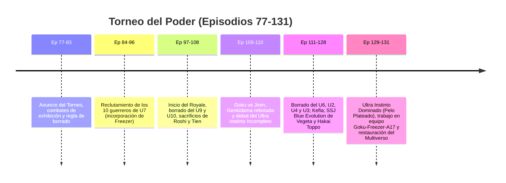

# Guía Hiperdetallada Episodio por Episodio: Dragon Ball Super (Episodios 1 al 131 + Películas + Manga)

Esta enciclopedia analiza los **131 episodios individuales del anime**, las **películas canon** y las **sagas del manga** de *Dragon Ball Super*, desglosando para cada capítulo el **Villano / Antagonista** y el **Hito / Transformación / Evento Histórico**.

---

## SAGA 1: LA BATALLA DE LOS DIOSES (EPISODIOS 1 A 14)

* **Episodio 1: ¿A quién irá a parar el premio de 100 millones de Zeni?**
  * *Villano:* Ninguno (Paz post-Buu).
  * *Hito:* Goku trabajando de agricultor; Goten y Trunks buscan un regalo para Videl; Mr. Satán le entrega a Goku el premio de 100 millones de Zeni.
* **Episodio 2: ¡Hacia el resort prometido! ¿Vegeta se va de viaje familiar?**
  * *Villano:* Bills (sueño premonitorio).
  * *Hito:* Viaje familiar de Vegeta, Bulma y Trunks; Bills despierta recordando al "Super Saiyajin Dios".
* **Episodio 3: ¿Dónde continúa el sueño? ¡En busca del Super Saiyajin Dios!**
  * *Villano:* Bills y Whis.
  * *Hito:* Whis ubica a Goku en el planeta de Kaio-sama del Norte y parten hacia allí.
* **Episodio 4: ¡Vamos por las Esferas del Dragón! ¡La gran estrategia de la Banda de Pilaf!**
  * *Villano:* Banda de Pilaf.
  * *Hito:* Fiesta de cumpleaños de Bulma en el barco de lujo *Princess Bulma*; Pilaf se infiltra buscando las esferas.
* **Episodio 5: ¡Batalla decisiva en el planeta de Kaio-sama! Goku vs. el Dios de la Destrucción Bills**
  * *Villano:* Bills.
  * *Hito:* Goku SSJ3 combate a Bills y es derrotado de dos simples toques en el cuello.
* **Episodio 6: ¡No hagan enojar al Dios de la Destrucción! La emocionante fiesta de cumpleaños**
  * *Villano:* Bills.
  * *Hito:* Bills llega a la fiesta en el barco; Vegeta entra en pánico intentando complacerlo con comida y bailes.
* **Episodio 7: ¡¿Cómo te atreves a tocar a mi Bulma?! ¿La furiosa mutación de Vegeta?**
  * *Villano:* Bills.
  * *Hito:* Bills abofetea a Bulma; **estallido de ira de Vegeta ("¡Nadie toca a mi Bulma!")** superando momentáneamente el poder de Goku SSJ3 contra Bills.
* **Episodio 8: ¡Goku regresa! ¿La última oportunidad de Bills-sama?**
  * *Villano:* Bills.
  * *Hito:* Goku se teletransporta al barco; duelo de piedra, papel o tijera de Oolong contra Bills por la Tierra.
* **Episodio 9: ¡Gracias por la espera, Bills-sama! ¡Finalmente nace el Super Saiyajin Dios!**
  * *Villano:* Bills.
  * *Hito Cumbre:* Shenlong explica el ritual; ritual de los 6 Saiyajin puros (Goku, Vegeta, Gohan, Goten, Trunks y el bebé Pan en Videl) desatando el **Super Saiyajin Dios (SSJ God - Aura Roja)**.
* **Episodio 10: ¡Muéstralo, Goku! ¡El poder del Super Saiyajin Dios!**
  * *Villano:* Bills.
  * *Hito:* Goku aprende a dominar y canalizar el ki divino en combate contra Bills.
* **Episodio 11: ¡Sigamos, Bills-sama! ¡La Batalla de los Dioses continúa!**
  * *Villano:* Bills.
  * *Hito:* Choque de ki divino en la estratósfera terrestre.
* **Episodio 12: ¿El universo se desintegra? ¡Colisión entre el Dios de la Destrucción y el SSJ Dios!**
  * *Villano:* Bills.
  * *Hito:* Los choques de puños entre Goku y Bills generan ondas expansivas que amenazan con destruir el Universo 7.
* **Episodio 13: ¡Goku, supera al Super Saiyajin Dios!**
  * *Villano:* Bills.
  * *Hito:* Goku pierde el aura del SSJ Dios pero absorbe el ki divino dentro de su estado base/SSJ1.
* **Episodio 14: ¡Todo mi poder! ¡El final de la Batalla de los Dioses!**
  * *Villano:* Bills.
  * *Hito:* Bills perdona la Tierra haciéndose el dormido y revela la existencia de un **Multiverso de 12 Universos**.

---

## SAGA 2: LA RESURRECCIÓN DE 'F' (EPISODIOS 15 A 27)

* **Episodio 15: ¡El héroe Satán hace un milagro! ¿Un desafío desde el espacio?**
  * *Villano:* Alienígenas Galbi.
  * *Hito:* Historia cómica exagerada de Mr. Satán sobre su supuesta pelea contra "Beebus".
* **Episodio 16: ¿Vegeta se convierte en discípulo? ¡A conquistar a Whis!**
  * *Villano:* Whis (maestro).
  * *Hito:* Vegeta cocina comida terrestre para Whis convenciéndolo de llevarlo a entrenar al planeta de Bills.
* **Episodio 17: ¡Pan ha nacido! ¿Y Goku se va de viaje de entrenamiento?**
  * *Villano:* Ninguno.
  * *Hito:* **Nacimiento de Pan**; Goku descubre que Vegeta entrena con Whis y se teletransporta allí.
* **Episodio 18: ¡Yo también estoy aquí! ¡Comienza el entrenamiento en el planeta de Bills!**
  * *Villano:* Whis.
  * *Hito:* Bases del control del ki divino: mover pesos masivos sin dejar escapar el aura.
* **Episodio 19: ¡Desesperación de nuevo! ¡La resurrección del malvado emperador Freezer!**
  * *Villanos:* Sorbet y Tagoma.
  * *Hito:* Sorbet y Tagoma usan las Esferas del Dragón de la Tierra para revivir a Freezer en pedazos.
* **Episodio 20: ¡La advertencia de Jaco! ¡Freezer y sus 1000 soldados se acercan!**
  * *Villanos:* Freezer y su ejército.
  * *Hito:* Llegada de **Jaco el Patrullero Galáctico**; Freezer entrena 4 meses por primera vez en su vida.
* **Episodio 21: ¡Comienza la venganza! ¡El ejército de Freezer ataca a Gohan!**
  * *Villanos:* Ejército de Freezer.
  * *Hito:* Los Guerreros Z (Gohan, Piccolo, Krillin, Tien y Roshi) combaten contra 1000 soldados.
* **Episodio 22: ¡Cambio! ¡Un regreso inesperado! ¡Su nombre es Ginyu!**
  * *Villano:* Ginyu (en el cuerpo de Tagoma).
  * *Hito:* El Capitán Ginyu (rana) logra intercambiar cuerpo con Tagoma tras escribir en el suelo.
* **Episodio 23: ¡La Tierra! ¡Gohan! ¡Desesperación absoluta! ¡Rápido Goku!**
  * *Villano:* Freezer.
  * *Hito:* **Sacrificio de Piccolo** al recibir el rayo mortal de Freezer dirigido a Gohan; Gohan eleva su ki al máximo para que Goku pueda teletransportarse.
* **Episodio 24: ¡Choque! ¡Freezer vs. Son Goku! ¡Este es el resultado de mi entrenamiento!**
  * *Villano:* Freezer.
  * *Hito:* Goku y Freezer combaten en sus estados base midiendo fuerzas.
* **Episodio 25: ¡Una batalla a muerte! La venganza de Golden Freezer**
  * *Villano:* Golden Freezer.
  * *Hito Cumbre:* Goku muestra el **Super Saiyajin Blue (SSJ Blue)** y Freezer revela su transformación **Golden Freezer**.
* **Episodio 26: ¡Una oportunidad de victoria! ¡Comienza el contraataque, Son Goku!**
  * *Villanos:* Golden Freezer y Sorbet.
  * *Hito:* Goku descubre el desgaste acelerado de ki de Golden Freezer; Sorbet dispara un rayo láser al pecho de Goku por la espalda.
* **Episodio 27: ¿La Tierra explota? ¡El Kamehameha decisivo!**
  * *Villano:* Golden Freezer.
  * *Hito Cumbre:* Vegeta SSJ Blue apalea a Freezer; Freezer destruye la Tierra explotando el núcleo; **Whis utiliza el Rebobinado Temporal de 3 segundos** y Goku elimina a Freezer con un Kamehameha.

---

## SAGA 3: TORNEO DEL UNIVERSO 6 VS UNIVERSO 7 (EPISODIOS 28 A 46)

* **Episodio 28: ¡El Dios de la Destrucción del U6! ¡Su nombre es Champa!**
  * *Villanos/Rivales:* Champa y Vados.
  * *Hito:* Presentación de Champa (hermano de Bills) y Vados en el planeta de Bills.
* **Episodio 29: ¡Se decide el torneo! ¡El capitán es más fuerte que Goku!**
  * *Villanos/Rivales:* Champa.
  * *Hito:* Organización del torneo U6 vs U7; Bills nombra a **Monaka** como el luchador más fuerte del U7.
* **Episodio 30: ¡Entrenamiento para el torneo! ¿Quiénes son los dos miembros restantes?**
  * *Hito:* Reclutamiento del equipo de U7: Goku, Vegeta, Piccolo, Majin Buu y Monaka.
* **Episodio 31: ¡Hacia Zuno-sama! ¡Averigüen el paradero de las Súper Esferas!**
  * *Hito:* Bulma y Jaco visitan a Zuno-sama; revelación del origen de las **Súper Esferas del Dragón** creadas por el Dios Dragón Zarama.
* **Episodios 32: ¡Comienza el torneo! ¡Todos hacia el Planeta Sin Nombre!**
  * *Villanos/Rivales:* Champa y su equipo.
  * *Hito:* Viaje al Planeta Sin Nombre; prueba escrita del torneo; Majin Buu reprueba al quedarse dormido.
* **Episodio 33: ¡Sorpréndanse Universo 6! ¡Este es el Super Saiyajin Son Goku!**
  * *Villanos/Rivales:* Botamo y Frost.
  * *Hito:* Goku vence a Botamo; combate contra Frost; Frost usa una aguja de veneno oculta para noquear a Goku.
* **Episodios 34: ¡Piccolo vs. Frost! ¡Apuéstalo todo al Makankosappo!**
  * *Villano/Rival:* Frost.
  * *Hito:* Frost envenena a Piccolo; Jaco descubre la aguja de veneno y Frost es descalificado y expuesto como un pirata espacial.
* **Episodios 35: ¡Convierte la rabia en poder! ¡La batalla total de Vegeta!**
  * *Villano/Rival:* Frost y Magetta.
  * *Hito:* Vegeta elimina a Frost de un solo golpe tras ingresar a la plataforma; inicio del combate contra el hombre de metal Magetta.
* **Episodio 36: ¡Un enemigo inesperadamente difícil! ¡La gran explosión de ira de Vegeta!**
  * *Villano/Rival:* Magetta.
  * *Hito:* Vegeta supera el barrera de calor de Magetta y lo vence insultando su sensibilidad emocional.
* **Episodios 37: ¡No olvides tu orgullo Saiyajin! Vegeta vs. Cabba**
  * *Villano/Rival:* Cabba.
  * *Hito:* Vegeta fuerza a Cabba a transformarse en **Super Saiyajin** mediante la rabia para enseñarle a liberar su poder.
* **Episodios 38: ¡El guerrero más fuerte del U6! ¡El asesino Hit aparece!**
  * *Villano/Rival:* Hit el Asesino.
  * *Hito:* Hit humilla a Vegeta SSJ Blue usando la técnica del **Salto Temporal (Tokitobashi)** de 0.1 segundos.
* **Episodios 39: ¿El contraataque del Salto Temporal? ¡La nueva técnica de Goku!**
  * *Villano/Rival:* Hit.
  * *Hito Cumbre:* Goku combina por primera vez el **Super Saiyajin Blue con el Kaioken x10**, superando la velocidad del tiempo de Hit.
* **Episodio 40: ¡Conclusión al fin! ¿El ganador es Bills o Champa?**
  * *Villanos/Rivales:* Hit y Champa.
  * *Hito:* Goku renuncia a la pelea para probar a Hit; Monaka ingresa y Hit simula ser derrotado de un golpe suave. **Universo 7 gana el torneo**. Aparición de **Zeno-sama**.
* **Episodios 41: ¡Ven, Dios de los Dragones! ¡Y concede mi deseo, por favor!**
  * *Hito:* Invocación de **Super Shenlong** con las esferas del tamaño de planetas; Bills pide restaurar la Tierra del Universo 6.
* **Episodios 42: ¡Problemas en la fiesta de victoria! ¿Goku vs. Monaka?**
  * *Villano:* Bills (disfrazado de Monaka).
  * *Hito:* Bills usa un traje gigante de Monaka para luchar contra Goku y mantener la mentira de su poder.
* **Episodio 43: ¿El Ki de Goku fuera de control? ¡Cuidar a Pan es difícil!**
  * *Hito:* Goku sufre del desorden de Ki retardado por usar el Kaioken x10; Pan vuela libremente por el espacio con la banda de Pilaf.
* **Episodios 44 – 46: El sello del Planeta Potaufeu (Saga del Agua Sobrehumana / Copy Vegeta - Relleno)**
  * *Villano:* Copy Vegeta.
  * *Hito:* Clon de Vegeta roba su poder; Goku SSJ Blue destruye a Copy Vegeta antes de que el Vegeta real se desintegre; Monaka destruye accidentalmente el núcleo del Agua Sobrehumana.

---

## SAGA 4: TRUNKS DEL FUTURO / GOKU BLACK (EPISODIOS 47 A 76)

* **Episodios 47: ¡SOS desde el futuro! ¡Un nuevo enemigo oscuro aparece!**
  * *Villano:* Goku Black.
  * *Hito:* Destrucción del futuro por **Goku Black**; disparo a Mai del futuro; Trunks escapa al presente en la máquina del tiempo.
* **Episodio 48: ¡HOPE! ¡De nuevo en el presente! Trunks despierta**
  * *Villano:* Goku Black.
  * *Hito:* Trunks llega herido al Templo de Bulma; confunde a Goku con Black y lo ataca al despertar.
* **Episodios 49: ¡Un mensaje del futuro! ¡Goku Black invade!**
  * *Villano:* Goku Black.
  * *Hito:* Goku Black viaja al presente persiguiendo a Trunks mediante la grieta temporal del **Anillo del Tiempo**.
* **Episodio 50: ¡Goku vs. Black! El camino hacia el futuro sellado**
  * *Villano:* Goku Black.
  * *Hito:* Goku SSJ2 combate a Goku Black; el Anillo del Tiempo succiona a Black de regreso al futuro, no sin antes destruir la máquina del tiempo de Trunks.
* **Episodios 51: ¡Sentimientos que trascienden el tiempo! Trunks y Mai**
  * *Hito:* Bulma encuentra la máquina del tiempo conservada en la que llegó Cell en el pasado.
* **Episodio 52: ¡Reencuentro de maestro y alumno! Son Gohan y Trunks del Futuro**
  * *Hito Emocional:* Trunks visita a Gohan y descubre que vive pacíficamente como un hombre de familia y académico.
* **Episodios 53: ¡Revelen la identidad de Black! ¡Al Reino Kaioshin del U10!**
  * *Villano:* Zamasu.
  * *Hito:* Bills, Whis y Goku visitan el Universo 10; Goku combate amistosamente contra el aprendiz de Kaioshin **Zamasu**.
* **Episodio 54: ¡Heredero de la sangre Saiyajin! La resolución de Trunks**
  * *Hito:* Vegeta entrena a Trunks en SSJ Blue obligándolo a no rendirse.
* **Episodios 55: ¡Quiero ver a Son Goku! ¡La llamada de Zeno-sama!**
  * *Hito:* Goku visita a Zeno-sama en el Palacio Sagrado; conoce al **Gran Sacerdote (Daishinkan)** y Zeno le entrega el botón de invocación inmediata.
* **Episodio 56: ¡La revancha con Goku Black! ¡Aparece el Super Saiyajin Rosé!**
  * *Villanos:* Goku Black y Zamasu del Futuro.
  * *Hito Cumbre:* Goku Black revela la transformación **Super Saiyajin Rosé** y se revela su alianza con el Zamasu del Futuro.
* **Episodio 57: ¡El Dios de cuerpo inmortal! Zamasu desciende**
  * *Villanos:* Zamasu del Futuro y Goku Black.
  * *Hito:* Zamasu revela su **inmortalidad absoluta**; Goku y Vegeta son derrotados y rescatados por Mai del futuro y Yajirobe.
* **Episodios 58: Zamasu y Black: El misterio se profundiza**
  * *Hito:* Regreso al presente; deducción del plan de Zamasu de usar las Súper Esferas del Dragón para pedir un cuerpo mortal poderoso (Goku) e inmortalidad.
* **Episodio 59: ¡Protejan al Kaioshin Gowasu! ¡Destruyan a Zamasu!**
  * *Villano:* Zamasu del Presente.
  * *Hito Cumbre:* Goku, Bills y Whis evitan el asesinato de Gowasu; **Bills ejecuta el Hakai sobre Zamasu del presente**, borrándolo de la existencia.
* **Episodio 60: ¡De vuelta al futuro! La identidad de Goku Black revelada**
  * *Villanos:* Goku Black y Zamasu.
  * *Hito:* Goku Black explica que asesinó a Goku tras intercambiar cuerpos en otra línea temporal (*Plan Cero Humanos*).
* **Episodios 61: ¡La ambición de Zamasu! El aterrador "Plan Cero Humanos"**
  * *Villanos:* Goku Black y Zamasu.
  * *Hito:* Trunks desata la transformación **Super Saiyajin Ira (SSJ Rage)** al ser culpado de los viajes en el tiempo.
* **Episodios 62: ¡Protegeré el mundo! ¡La furia de Trunks explota!**
  * *Hito:* Trunks sostiene el combate mientras Goku viaja al presente para aprender el **Mafuba** de Roshi.
* **Episodios 63: ¡No le faltes el respeto a las células Saiyajin! ¡Comienza la feroz batalla de Vegeta!**
  * *Villano:* Goku Black.
  * *Hito:* Vegeta entrena en la Habitación del Tiempo y humilla despiadadamente a Goku Black en el futuro.
* **Episodios 64: ¡Adórenlo! ¡Alábenlo! ¡El nacimiento de Zamasu Fusionado!**
  * *Villanos:* Zamasu Fusionado.
  * *Hito Cumbre:* Goku Black y Zamasu del Futuro se fusionan mediante los Pendientes Pothala naciendo **Zamasu Fusionado**.
* **Episodios 65: ¿El juicio final? El poder supremo del Dios Absoluto**
  * *Villano:* Zamasu Fusionado.
  * *Hito:* Zamasu despliega el muro de luz sagrada y rayos de la absolución.
* **Episodio 66: ¡La batalla decisiva! ¡El milagroso poder de los guerreros inquebrantables!**
  * *Villano:* Zamasu Fusionado.
  * *Hito Cumbre:* Nace **Vegetto Blue (Super Saiyajin Blue)**; Trunks reúne la energía de los sobrevivientes creando la **Espada de la Esperanza** y corta a Zamasu Fusionado por la mitad.
* **Episodio 67: ¡Con una nueva ESPERANZA en el corazón! ¡Adiós Trunks!**
  * *Villano:* Zamasu Infinito.
  * *Hito Cumbre:* Zamasu se convierte en la atmósfera del universo; Goku presiona el botón llamando al Zeno-sama del Futuro; **Zeno-sama borra por completo esa línea temporal**; Trunks se despide viajando a una nueva línea de tiempo.
* **Episodios 68 – 76 (Transición y Relleno de Paz):**
  * Ep. 68: Deseos a Shenlong.
  * Ep. 69: Crossover hilarante con **Arale Norimaki** (Arale vs Vegeta y Goku).
  * Ep. 70: Partido de Béisbol entre U7 y U6 (Victoria icónica de Yamcha en la pose de muerte).
  * Ep. 71–72: **Asesinatos de Hit**: Goku contrata a Hit en secreto para que lo asesine; Goku muere temporalmente por un rayo al corazón y se revive a sí mismo con una ráfaga de ki lanzada al aire previa a su muerte.
  * Ep. 73–74: Película del Gran Saiyaman y parásito Watagash.
  * Ep. 75–76: Entrenamiento de Goku y Krillin en el Bosque del Terror superando sus traumas del pasado.

---

## SAGA 5: TORNEO DEL PODER / SUPERVIVENCIA UNIVERSAL (EPISODIOS 77 A 131)

* **Episodio 77: ¡Hagámoslo Zeno-sama! ¡El torneo de artes marciales del Multiverso!**
  * *Hito:* Goku le recuerda a Zeno-sama el torneo prometido; inicio oficial del **Torneo del Poder**.
* **Episodio 78: ¿Los Dioses de cada universo consternados? Universos que pierdan serán borrados**
  * *Villano:* Zeno-sama (regla de borrado).
  * *Hito:* Revelación de la regla de penalización: **los universos eliminados serán borrados de la existencia**. Combate de exhibición U7 vs U9.
* **Episodio 79: ¡Basil el pateador del U9 vs. Majin Buu del U7!**
  * *Villanos/Rivales:* Trio de Dangers (U9).
  * *Hito:* Majin Buu destruye a Basil tras ver herido a Mr. Satán.
* **Episodio 80: ¡Despierta el espíritu de pelea dormido! ¡La batalla de Son Gohan!**
  * *Villano/Rival:* Lavender.
  * *Hito:* Gohan combate a ciegas tras ser infectado con el veneno de Lavender, terminando en empate.
* **Episodio 81: ¡Bergamo el triturador vs. Son Goku! ¿Quién tiene el poder ilimitado?**
  * *Villano/Rival:* Bergamo y Toppo.
  * *Hito:* Goku vence a Bergamo; **Toppo (Justiciero del U11)** desafía a Goku calificándolo de villano multiversal y revela la existencia de **Jiren el Gris**.
* **Episodio 82: ¡No le perdones a Son Goku! ¡El guerrero de la justicia Toppo me interrumpe!**
  * *Villano/Rival:* Toppo.
  * *Hito:* Duelo interrumpido entre Goku SSJ Blue y Toppo por Daishinkan.
* **Episodio 83: ¡Formen el equipo del Universo 7! ¿Quiénes son los 10 más fuertes?**
  * *Hito:* **Nacimiento de Bra (Bulla)**; Whis acelera mágicamente el parto de Bulma para que Vegeta acceda a participar.
* **Episodios 84 – 91 (Reclutamiento del U7):**
  * Ep. 84–85: Reclutamiento de Krillin y A18; combate de prueba; Majin Buu se vuelve delgado.
  * Ep. 86–87: Goku encuentra al **Androide 17** trabajando como guardabosques planetario; combaten a cazadores espaciales.
  * Ep. 88: Piccolo entrena a Gohan ayudándolo a recuperar el estado **Gohan Definitivo**.
  * Ep. 89–90: Tien Shinhan y Roshi se unen al equipo; spar entre Gohan Definitivo y Goku SSJ Blue.
  * Ep. 91: Majin Buu se queda dormido por 2 meses ininterrumpidos y queda fuera.
* **Episodio 92: ¡Anuncio de emergencia! ¡El equipo de 10 miembros no está completo!**
  * *Hito:* Goku decide reclutar a **Freezer** desde el Infierno por 24 horas usando la ayuda de Uranai Baba.
* **Episodios 93 – 95 (El Retorno de Freezer):**
  * Goku visita a Freezer en el Infierno; Freezer acepta participar bajo la promesa de ser revivido. Asesinos del U9 los emboscan; Freezer controla una bola de **Energía de Destrucción** lanzada por los asesinos.
* **Episodios 96: ¡El momento ha llegado! ¡Al Mundo de la Nada por el destino del Universo!**
  * *Hito:* Los 8 universos participantes llegan a la plataforma gigante en el Mundo de la Nada.
* **Episodio 97: ¡Sobrevive! ¡El Torneo del Poder finalmente da inicio!**
  * *Hito Cumbre:* **Comienza el Torneo del Poder** (Royale de 80 guerreros en simultáneo).
* **Episodio 98: ¡Ah, incertidumbre! ¡El universo en desesperación!**
  * *Villano:* Zeno-sama (borrado).
  * *Hito Cumbre:* Goku y Vegeta eliminan al Trio de Dangers; **Zeno-sama borra al Universo 9 (Primer universo eliminado)**.
* **Episodio 99: ¡Muéstralo! ¡El verdadero poder de Krillin!**
  * *Villano:* Frost.
  * *Hito:* Krillin salva a N°18 pero es atacado por la espalda por Frost, convirtiéndose en el primer eliminado del U7.
* **Episodio 100: ¡Fuera de control! ¡El salvaje guerrero descontrolado despierta!**
  * *Villanos/Rivales:* Kale y Jiren.
  * *Hito:* Kale desata la transformación **Berserker (Super Saiyajin Legendario U6)**; Jiren noquea a Kale de un solo golpe.
* **Episodios 101 – 104 (Eliminaciones Progresivas):**
  * Ep. 103: Gohan elimina a Obuni; **Zeno-sama borra al Universo 10**.
  * Ep. 104: Goku SSJ Dios y Hit se alían derrotando a Dyspo y Kunshi.
* **Episodio 105: ¡Una batalla desesperada! ¡El sacrificio del Maestro Roshi!**
  * *Hito Emocional:* Roshi vence a Caway, Dercori y Ganos usando el Mafuba; Roshi sufre un paro cardíaco por agotamiento y Goku lo revive entre lágrimas con ráfagas de ki al corazón.
* **Episodio 106: ¡Encuéntralo! ¡Duelo a muerte con un francotirador invisible!**
  * *Hito:* Tien Shinhan se sacrifica eliminando al francotirador Hermila.
* **Episodio 107: ¡La venganza de 'F'! ¿Una trampa astuta preparada?**
  * *Villano:* Frost.
  * *Hito:* Frost engaña a Roshi para que ejecute el Mafuba y lo desvía hacia Vegeta; Roshi libera a Vegeta a tiempo y Vegeta saca volando a Magetta. Roshi se elimina voluntariamente.
* **Episodio 108: ¡Freezer y Frost! ¿La malicia unida?**
  * *Villanos:* Freezer y Frost.
  * *Hito:* Freezer finge aliarse con Frost para luego traicionarlo y sacarlo de la plataforma; **Zeno-sama borra a Frost al instante** por intentar atacar desde la tribuna.
* **Episodios 109 – 110 (Goku vs. Jiren & El Ultra Instinto Incompleto):**
  * **Episodio 109:** Goku usa el SSJ Blue Kaioken x20 contra Jiren sin hacerle daño; lanza una Genkidama con la energía de U7; Jiren la regresa empujando a Goku dentro de su propia explosión.
  * **Episodio 110 (Hito Cumbre):** Goku emerge de la explosión rompiendo la cáscara de su potencial, desatando el **Ultra Instinto Incompleto / Señal (Migatte no Gokui "Kiti")** (ojos plateados, evasión autónoma perfecta).
* **Episodio 111: ¡La batalla surrealista! ¡Hit vs. Jiren!**
  * *Villano/Rival:* Jiren.
  * *Hito:* Hit atrapa a Jiren en la *Caja del Tiempo*, pero Jiren rompe la dimensión de tiempo con su mirada y elimina a Hit.
* **Episodios 112 – 116 (La Amenaza de Kefla):**
  * Ep. 114: Caulifla y Kale usan los Pothala del U6 naciendo **Kefla**.
  * Ep. 116: Goku re-despierta el Ultra Instinto Incompleto y elimina a Kefla SSJ2 con un **Kamehameha Deslizante a bocajarro** sobre su rayo de energía.
* **Episodios 117 – 121 (Borrados Múltiples):**
  * Ep. 118: Gohan y Piccolo eliminan a Saonel y Pirina; **Zeno-sama borra al Universo 6 y Universo 2 simultáneamente**.
  * Ep. 119: Piccolo es eliminado por el insecto Damon; **Zeno-sama borra al Universo 4**.
  * Ep. 121: A17 destruye el reactor del gigante Aniraza; **Zeno-sama borra al Universo 3**.
* **Episodios 122 – 123 (La Recta Final: U7 vs U11):**
  * Vegeta enfrenta a Jiren conectando el *Final Flash*.
  * **Episodio 123:** Vegeta rompe sus límites y despierta el **Super Saiyajin Blue Evolution (SSJ Blue Evolved)**.
* **Episodio 124: ¡El feroz asalto tempestuoso! ¡La última resistencia de Gohan!**
  * *Hito:* Gohan inmoviliza a Dyspo en una jaula de ki y le pide a A18 que los saque a ambos fuera del ring; **sacrificio de Gohan**.
* **Episodios 125 – 126 (Toppo Dios de la Destrucción):**
  * Toppo abandona sus ideales y despierta la transformación de **Dios de la Destrucción Toppo** (aura de Hakai).
  * **Episodio 126:** Vegeta SSJ Blue Evolved combate a Hakai Toppo y desata su **Explosión Final**, sobreviviendo y eliminando a Toppo.
* **Episodios 127 – 128 (El Sacrificio de A17 y la Caída de Vegeta):**
  * Jiren desata su poder máximo. **Androide 17 se sacrifica** creando barreras de ki para proteger a Goku y Vegeta de un ataque mortal de Jiren.
  * Vegeta exhausto en estado base lucha contra Jiren hasta ser eliminado, entregándole su ki restante a Goku.
* **Episodios 129 – 130 (El Ultra Instinto Dominado):**
  * **Episodio 129 (Hito Cumbre):** Goku domina por completo la Doctrina del Juicio desatando el **Ultra Instinto Dominado (Pelo Plateado)**.
  * **Episodio 130:** Goku UI domina a Jiren en un combate épico. Jiren intenta atacar a la tribuna por frustración. Goku lo vence, pero sufre el desgarrador contragolpe físico por el uso excesivo de ki divino.
* **Episodio 131: ¡Una conclusión milagrosa! ¡Adiós Goku! ¡Hasta que nos volvamos a encontrar!**
  * *Hito Cumbre Final:* Goku exhausto en estado base y Freezer combaten en un trabajo de equipo histórico embistiendo a Jiren fuera de la plataforma.
  * **Androide 17 reaparece** (sobrevivió a su explosión) quedando como el único superviviente en el ring y pide a Super Shenlong el deseo de **restaurar todos los universos borrados**.
  * Goku y Vegeta tienen un combate amistoso en el desierto tomando la pose de pelea clásica de la Saga Saiyajin.

---

## DRAGON BALL DAIMA (DESGLOSE EPISODIO POR EPISODIO)

* **Episodio 1: Conspiración**
  * *Villano:* Rey Gomah y Degesu.
  * *Hito:* Gomah observa la derrota de Buu en pantallas mágicas; viaja a la Tierra y pide a Shenlong convertir a Goku y a los Guerreros Z en **niños (versiones Mini)**.
* **Episodio 2: Glorio**
  * *Villano:* Rey Gomah / Glorio.
  * *Hito:* Goku Mini recupera el **Báculo Sagrado (Nyoibo)**; conoce a Glorio, un piloto del Tercer Reino Demoníaco que llega a llevar a Goku al Demon Realm.
* **Episodio 3: Viaje**
  * *Villanos:* Criaturas del Reino Demoníaco.
  * *Hito:* Goku Mini, Shin Mini (Supremo Kaioshin) y Glorio cruzan la puerta dimensional hacia el **Reino Demoníaco (Demon Realm)**.
* **Episodio 4: Tecnociudad**
  * *Villanos:* Oficiales demoníacos de aduana.
  * *Hito:* Llegada a la primera región del Demon Realm; exploran la ciudad demoníaca ajustándose a la densidad del aire.
* **Episodio 5: Panzy**
  * *Villanos:* Guardia real demoníaca.
  * *Hito:* Conocen a la princesa demonio **Panzy** (hija del Rey Kadam), quien se une al grupo como mecánica y guía.
* **Episodio 6: El Primer Tamagami**
  * *Villano:* Tamagami (Guardión Autómata).
  * *Hito:* Enfrentan al primer **Tamagami** (guardián de la esfera de 1 estrella del Demon Realm); Goku Mini usa el Báculo Sagrado para compensar el alcance en combate.
* **Episodio 7: Las Regiones Demoníacas**
  * *Villanos:* Dra. Arinsu (en las sombras).
  * *Hito:* Explicación de la estructura de las 3 regiones del Demon Realm y revelación del **origen demoníaco de los Glind (Supremos Kaioshin)**.
