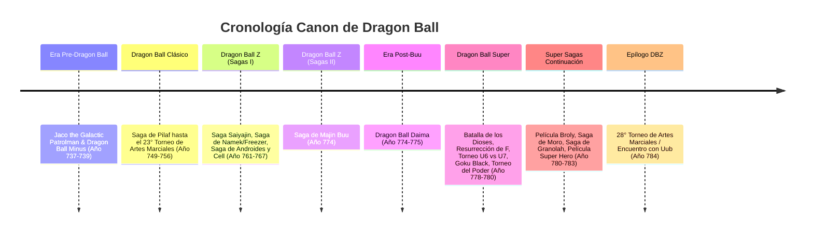
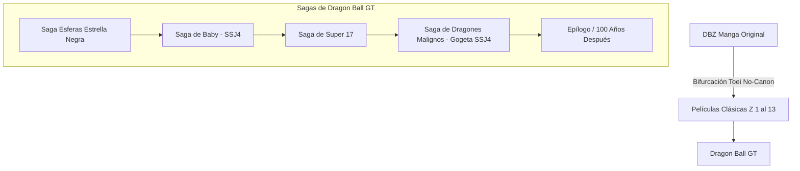

# Enciclopedia y Cronología Detallada de Dragon Ball

Esta guía contiene la cronología exhaustiva y detallada de **Dragon Ball**, dividida rigurosamente entre la **Línea Temporal Canon** (supervisada y creada por Akira Toriyama / Toyotaro / Shueisha) y la **Línea Temporal Alternativa No Canon** (las 13 Películas Clásicas de DBZ y la serie completa de *Dragon Ball GT*).

---

## PARTE 1: Línea Temporal Canon (Oficial)

El canon oficial está compuesto por el manga original de Akira Toriyama (*Dragon Ball* / *Dragon Ball Z*), la precuela *Jaco the Galactic Patrolman / Dragon Ball Minus*, la serie *Dragon Ball Daima*, la serie y manga de *Dragon Ball Super*, y las películas *Super: Broly* y *Super: Super Hero*.

---

### A. Era Pre-Dragon Ball (Año 737 – 739)

#### Jaco the Galactic Patrolman & Dragon Ball Minus
* **Contexto:** En el Planeta Vegeta, Bardock (un guerrero de clase baja) regresa de una misión y nota la inusual convocatoria de Freezer para que todos los Saiyajin regresen al planeta natal.
* **Envío de Kakarotto a la Tierra:** Presintiendo una catástrofe, Bardock y su esposa **Gine** deciden robar una cápsula espacial y enviar a su hijo **Kakarotto** (de 3 años) al planeta Tierra, un mundo lejano y con habitantes de bajo poder de pelea, para salvarlo.
* **Destrucción del Planeta Vegeta:** Freezer destruye el planeta con una Supernova por temor a que surja el legendario *Super Saiyajin*. Solo sobreviven unos pocos Saiyajin fuera del planeta (Vegeta, Nappa, Raditz, Kakarotto, y en la película *Broly*, Broly y Paragus).
* **Llegada a la Tierra:** El anciano **Son Gohan** encuentra la cápsula en la Montaña Paoz y adopta al niño nombrándolo **Son Goku**. Inicialmente violento, Goku sufre un fuerte golpe en la cabeza al caer por un barranco, lo que borra su programación genética destructiva y lo convierte en un niño noble y dócil.

---

### B. Dragon Ball Clásico (Año 749 – 756)

#### 1. Saga de Pilaf (Episodios DB 1 – 13)
* **Año 749:** Bulma, una joven científica de 16 años, llega a la Montaña Paoz buscando la esfera de 4 estrellas que pertenecía al fallecido abuelo de Goku.
* **Eventos Clave:** Goku y Bulma inician el viaje. Conocen al Maestro Roshi (quien le regala la Nube Voladora y la esfera de 3 estrellas), a Oolong, Yamcha, Puar y Milk (Chi-Chi).
* **Conflicto:** El Emperador Pilaf reúne las 7 esferas para dominar el mundo, pero Oolong se anticipa pidiendo un panty a Shenlong. Goku observa la luna llena y se transforma por primera vez en pantalla en **Gran Mono (Oozaru)**, destruyendo el castillo de Pilaf.

#### 2. Saga del 21° Torneo de las Artes Marciales (Episodios DB 14 – 28)
* **Entrenamiento:** Goku y Krillin se convierten en discípulos del Maestro Roshi en la Kame House, realizando entrenamientos físicos extremos (repartir leche, arar campos con las manos, huir de dinosaurios) llevando caparazones de tortuga pesados.
* **El Torneo (Año 750):** Participan Goku, Krillin, Yamcha y el Maestro Roshi disfrazado como **Jackie Chun**.
* **Final:** Jackie Chun derrota a Goku en la final tras una intensa batalla en la que Goku vuelve a transformarse en Oozaru y Roshi destruye la Luna con un Kamehameha Máximo para devolverlo a su forma humana.

#### 3. Saga del Ejército de la Cinta Roja / Red Ribbon (Episodios DB 29 – 68)
* **Búsqueda solitaria:** Goku viaja por el mundo para recuperar la esfera de 4 estrellas de su abuelo.
* **Enfrentamientos:** Derrota a la Torre de Fuerza (General White, Androide 8 / Octavio), al General Blue en la Aldea Pingüino (crossover con *Dr. Slump*) y escala la Torre de Karin.
* **Mercenario Tao Pai Pai:** Asesina a Bora (padre de Upa). Goku sube a la Torre de Karin, entrena con el maestro Karin durante 3 días bebendo el "Agua Sagrada" (desarrollando condición física) y regresa para derrotar a Tao Pai Pai y desmantelar por completo la sede principal de la Red Ribbon.

#### 4. Saga de Uranai Baba (Episodios DB 69 – 83)
* **El Quinto Guerrero:** Para encontrar la última esfera (oculta al radar por Pilaf), Goku y sus amigos acuden a la adivina Uranai Baba y deben vencer a sus 5 guerreros.
* **Emoción:** El quinto guerrero resulta ser el **Abuelo Gohan**, a quien Baba le otorgó un día en la Tierra. Tras un emotivo combate, Shenlong es invocado para revivir a Bora.

#### 5. Saga del 22° Torneo de las Artes Marciales (Episodios DB 84 – 101)
* **Año 753:** Rivalidad entre la Escuela Tortuga (Roshi) y la Escuela Grulla (Maestro Tsuru).
* **Debut:** Introducción de **Tien Shinhan** y **Chaoz**.
* **Final:** Tien Shinhan vence a Goku por un accidente fortuito (Goku choca contra un autobús antes de tocar suelo fuera del cuadrilátero). Tien comprende los ideales nobles de Roshi y abandona el camino del mal.

#### 6. Saga del Rey Piccolo / Piccolo Daimaō (Episodios DB 102 – 122)
* **Tragedia:** Tambourine, esbirro de Piccolo Daimaō, asesina a Krillin y roba la esfera de Goku.
* **Rejuvenecimiento:** Piccolo Daimaō (liberado por Pilaf) reúne las esferas, asesina al Maestro Roshi y Chaoz, pide la juventud eterna a Shenlong y asesina al dragón.
* **Agua Ultra Divina:** Goku bebe el veneno mortal del Agua Ultra Divina en el templo de Karin, desatando su poder oculto.
* **Batalla Final:** Goku atraviesa el pecho de Piccolo Daimaō con el *Golpe del Ozaru*. Antes de morir, Piccolo expulsa un huevo que contiene a su reencarnación y hijo: **Piccolo Jr.**

#### 7. Saga del 23° Torneo de las Artes Marciales (Episodios DB 123 – 153)
* **Año 756:** Goku entrena 3 años en el Templo Sagrado con **Kami-sama** y **Mr. Popo**, aprendiendo a controlar su ki y luchar con los ojos cerrados.
* **Torneo:** Goku regresa ya crecido (18 años). Cumple su promesa de casarse con Milk.
* **Final Dramático:** Goku se enfrenta a Piccolo Jr. (Ma Junior) en una batalla brutal. Goku resulta gravemente herido pero logra vencer arrojándose contra Piccolo fuera del ring, coronándose campeón por primera vez. Le perdona la vida a Piccolo para conservar a Kami-sama.

---

### C. Dragon Ball Z - Primera Parte (Año 761 – 774)

#### 1. Saga Saiyajin (Episodios DBZ 1 – 35 / Kai 1 – 18)
* **Año 761:** Llegada de **Raditz** a la Tierra. Revela que Goku es su hermano y pertenece a la raza exterminadora de los Saiyajin. Secuestra al pequeño **Gohan** (de 4 años).
* **Muerte de Goku:** Goku y Piccolo se alían. Gohan demuestra un estallido de poder oculto (ki de 1307) embistiendo a Raditz. Goku inmoviliza a Raditz y Piccolo los atraviesa a ambos con el *Makankosappo*.
* **Año 762 - Llegada de Vegeta y Nappa:** Goku entrena en el Más Allá recorriendo el Camino de la Serpiente hasta el planeta de **Kaio-sama**, aprendiendo el *Kaioken* y la *Genkidama*. Yamcha, Chaoz, Tien Shinhan y Piccolo mueren defendiendo la Tierra.
* **Batalla decisiva:** Goku regresa a la Tierra. Derrota a Nappa. Enfrenta a Vegeta (choque del Kamehameha Kaioken x4 vs. Galick Gun). Vegeta se transforma en Oozaru. Gohan, Krillin y Yajirobe logran cortarle la cola a Vegeta. Goku pide a Krillin que le perdone la vida a Vegeta para volver a luchar.

#### 2. Saga de Namek y Freezer (Episodios DBZ 36 – 107 / Kai 19 – 54)
* **Viaje Espacial:** Bulma, Krillin y Gohan viajan a Namek en la nave del Kami-sama original para usar las Esferas del Dragón Namekianas (Polunga) y revivir a sus amigos.
* **Guerra a Tres Bandas:** Las tropas de Freezer, Vegeta (buscando la inmortalidad) y el grupo de Krillin compiten por las 7 esferas.
* **Fuerzas Ginyu:** Goku entrena a 100g de gravedad espacial. Llega a Namek y vence fácilmente a Recoome y Burter. El Capitán Ginyu usa el *Cambio de Cuerpo*, pero Goku recupera su forma gracias a un rana namekiana.
* **Gran Batalla contra Freezer:** Piccolo es revivido y fusionado con Nail. Freezer muestra sus 4 formas. Goku se recupera en la cápsula médica e inicia el combate final. Usa el Kaioken x20 y una Genkidama gigantesca.
* **Despertar del Super Saiyajin:** Freezer sobrevive a la Genkidama, hiere a Piccolo y hace explotar en pedazos a Krillin. La ira desborda a Goku, despertando el legendario **Super Saiyajin (SSJ1)**. Goku vence a Freezer en un Planeta Namek a punto de explotar y escapa en una cápsula de las Fuerzas Ginyu hacia el planeta Yardrat.

#### 3. Saga de los Androides y Cell (Episodios DBZ 118 – 194 / Kai 55 – 98)
* **Año 764:** Freezer (Mecha Freezer) y su padre King Cold llegan a la Tierra. Un misterioso joven del futuro, **Trunks**, los descuartiza fácilmente convertido en Super Saiyajin.
* **Advertencia:** Trunks revela ser el hijo de Vegeta y Bulma del futuro. Advierte sobre la muerte de Goku por una enfermedad cardíaca y la llegada de dos androides mortales en 3 años creados por el Dr. Gero (Red Ribbon).
* **Año 767 - Los Androides:** Aparecen Androide 19 y 20 (Dr. Gero). Goku sufre el ataque al corazón. Vegeta revela haber alcanzado el **Super Saiyajin** y destruye a N°19. El Dr. Gero activa a **N°17** y **N°18**, además de **N°16**. N°18 rompe el brazo de Vegeta.
* **La amenaza de Cell:** Un bio-androide del futuro (Cell) llega en una segunda máquina del tiempo. Absorbe la energía de miles de humanos para fortalecerse.
* **Habitación del Tiempo:** Goku, Gohan, Vegeta y Trunks entrenan en el Templo de Kami-sama. Vegeta alcanza la forma *Super Vegeta (Grade 2)* y humilla a Cell Semiperfecto, pero llevado por el orgullo permite que Cell absorba a N°18 para alcanzar su **Forma Perfecta**.
* **Los Juegos de Cell:** Goku y Gohan entrenan para dominar el Super Saiyajin como su estado base (*Full Power SSJ*). Goku lucha contra Cell, se rinde y cede su lugar a Gohan. Cell crea a los *Cell Juniors* para torturar a los guerreros.
* **Super Saiyajin 2:** Cell destruye la cabeza del Androide 16. La rabia pura desata el **Super Saiyajin 2 (SSJ2)** en Gohan, superando abrumadoramente a Cell.
* **Sacrificio de Goku:** Cell intenta autodestruirse. Goku usa la Teletransportación para llevarse a Cell al planeta de Kaio-sama, muriendo en la explosión. Cell regresa en su *Forma Super Perfecta* tras regenerarse.
* **Kamehameha Padre e Hijo:** Con la ayuda espiritual de Goku y la distracción de Vegeta, Gohan desintegra a Cell con un Kamehameha final a nivel celular.

#### 4. Saga de Majin Buu (Episodios DBZ 200 – 288 / Kai 99 – 159)
* **Año 774:** Transcurren 7 años. Gohan asiste a la preparatoria Estrella Naranja como el *Gran Saiyaman* y conoce a **Videl**.
* **25° Torneo de Artes Marciales:** Goku regresa a la Tierra por 1 día con permiso de Uranai Baba. Nacimiento de Goten y Trunks niño.
* **El despertar del Demonio:** Los brujos Babidi y Dabra buscan revivir a **Majin Buu**. Babidi controla la oscuridad del corazón de Vegeta (**Majin Vegeta**). Vegeta lucha contra Goku en SSJ2.
* **Liberación de Buu:** La energía del combate libera a Majin Buu Gordo. Vegeta se sacrifica en una explosión suicida para destruirlo, pero Buu se regenera.
* **Super Saiyajin 3:** Goku muestra por primera vez la transformación del **Super Saiyajin 3 (SSJ3)** para entretener a Buu mientras Trunks busca el Radar del Dragón. Goku enseña la *Danza de la Fusión* a Goten y Trunks.
* **EVO de Buu:** Buu se hace amigo de Mr. Satán y un perrito (Bee). Bandidos disparan al perro y Satán, desatando la ira de Buu, expulsando su parte maligna (Evil Buu), quien absorbe a Buu Gordo convirtiéndose en **Super Buu**.
* **Absorciones:** Super Buu absorbe a **Gotenks SSJ3**, a **Piccolo** y a **Gohan Definitivo** (quien desató su potencial con el Anciano Kaioshin).
* **Nacimiento de Vegetto:** Goku (revivido por la vida del Anciano Kaioshin) y Vegeta usas los *Pendientes Pothala* para fusionarse en **Vegetto**, humillando por completo a Buu. Vegetto se deja absorber a propósito para rescatar a sus amigos dentro del cuerpo de Buu.
* **Kid Buu y la Batalla Final:** Al retirar a Buu Gordo del interior, Buu regresa a su forma original desprovista de razón: **Kid Buu**. Destruye la Tierra de un disparo.
* **Planeta Kaioshin:** Goku SSJ3 y Vegeta combaten a Kid Buu. Vegeta resiste palizas para ganar tiempo mientras Goku acumula energía para la **Genkidama Universal**, nutrida con la energía de toda la humanidad (convencida por Mr. Satán). Goku lanza la Genkidama, deseando que Buu reencarne como una buena persona, y lo destruye.

---

### D. Era Intermedia Canon (Post-Buu): Dragon Ball Daima (Año 774 – 775)
* **Contexto:** Ubicado pocos meses después de la victoria sobre Majin Buu.
* **La Conspiración del Reino Demoníaco:** El nuevo Rey del Reino Demoníaco, **Gomah**, temeroso del poder de los Guerreros Z que derrotaron a Buu, utiliza las esferas oscuras para pedir un deseo a Shenlong: **convertir a Goku y todos sus amigos en niños**.
* **La Aventura:** Goku (con su Báculo Sagrado), junto al Supremo Kaioshin (también rejuvenecido) y nuevos aliados como **Glorio** y **Panzy**, parten hacia el Reino Demoníaco para romper la maldición y desenredar viejos secretos sobre los Namekianos y la magia primordial.

---

### E. Era de los Dioses: Dragon Ball Super (Año 778 – 783)

#### 1. Saga de la Batalla de los Dioses (Película 2013 / DBS Ep. 1–14)
* **Año 778:** **Bills** (Dios de la Destrucción del Universo 7) despierta tras un sueño premonitorio sobre el "Super Saiyajin Dios".
* **Encounter en Kaiosama:** Bills vence a Goku SSJ3 de dos golpes.
* **Ritual Divino:** En la fiesta de cumpleaños de Bulma, Shenlong explica el ritual: 5 Saiyajin de corazón puro deben verter su iluminación en un sexto. Participan Goku, Vegeta, Gohan, Goten, Trunks y el bebé no nacido en el vientre de Videl (**Pan**).
* **Super Saiyajin Dios:** Goku alcanza el **SSJ Dios (Aura Roja)** y lucha contra Bills en la atmósfera terrestre. Bills decide no destruir la Tierra y revela que existen **12 Universos**.

#### 2. Saga de La Resurrección de 'F' (Película 2015 / DBS Ep. 15–27)
* **Año 779:** Sorbet reconstruye a Freezer usando las Esferas del Dragón. Freezer entrena intensamente durante 4 meses por primera vez en su vida.
* **Super Saiyajin Blue:** Goku y Vegeta entrenan en el planeta de Bills con **Whis**, aprendiendo a controlar el ki divino sin que se desborde. Alcanzan el **Super Saiyajin Blue (SSJ God SSJ)**.
* **Golden Freezer:** Freezer ataca la Tierra con su forma dorada. Aunque su poder supera inicialmente al SSJ Blue, su forma consume ki rápidamente. Freezer destruye la Tierra como último recurso, pero Whis retrocede el tiempo 3 segundos y Goku remata a Freezer con un Kamehameha.

#### 3. Saga del Torneo del Universo 6 (DBS Ep. 28–46 / Manga Cap. 7–14)
* **Conflicto:** Bills y su hermano **Champa** (Dios del Universo 6) organizan un torneo de 5 vs 5. El ganador se queda con las *Súper Esferas del Dragón*.
* **Guerreros:** El equipo de U7 incorpora a Goku, Vegeta, Piccolo, Monaka y Majin Buu (quien se duerme). U6 presenta a **Hit** (asesino con la habilidad *Salto Temporal*), Cabba, Frost, Magetta y Botamo.
* **Innovación:** Goku combina el **SSJ Blue con el Kaioken x10** contra el Salto Temporal de Hit. Monaka le da la victoria final a U7. Invocan a **Super Shenlong** usando las Súper Esferas del tamaño de planetas.

#### 4. Saga de Goku Black / Trunks del Futuro (DBS Ep. 47–76 / Manga Cap. 14–26)
* **Amenaza en el Futuro:** El mundo de Trunks del Futuro es devastado por un enemigo con el rostro de Goku: **Goku Black**.
* **El Secreto:** Zamasu (aprendiz de Kaioshin del Universo 10) desarrolla un odio enfermizo hacia los mortales. En otra línea temporal usó las Súper Esferas para intercambiar cuerpo con Goku y aliarse con el Zamasu de la línea de Trunks (quien se hizo inmortal).
* **Super Saiyajin Rosé:** Goku Black alcanza la transformación divina **SSJ Rosé**.
* **Retorno de Vegetto Blue:** Goku, Vegeta y Trunks viajan al futuro. Goku y Vegeta se fusionan en **Vegetto Blue**. Trunks corta a Zamasu Fusionado usando la *Espada de la Esperanza* (energía de los sobrevivientes). Zamasu intenta convertirse en la estructura misma del universo. Goku invoca al Zeno-sama del Futuro, quien borra por completo esa línea temporal.

#### 5. Saga del Torneo del Poder (DBS Ep. 77–131 / Manga Cap. 27–42)
* **Año 780:** Zeno-sama organiza un Torneo de Royale de 80 guerreros representando a 8 universos. Los universos derrotados serán borrados de la existencia.
* **Equipo del Universo 7:** Goku, Vegeta, Gohan (Capitán), Piccolo, A17, A18, Krillin, Tien Shinhan, Maestro Roshi y **Freezer** (reclutado por 24h desde el infierno).
* **El rival supremo:** **Jiren** del Universo 11 (Pride Troopers), un mortal cuyo poder supera al de su propio Dios de la Destrucción (Belmod).
* **Ultra Instinto (Migatte no Gokui):** Goku rompe sus límites al absorber la energía de su propia Genkidama contra Jiren, desatando por primera vez el estado donde el cuerpo reacciona de forma autónoma sin pasar por el cerebro: **Ultra Instinto Incompleto (Señal)** y posteriormente el **Ultra Instinto Dominado / Doctrina del Juicio (Pelo Plateado)**.
* **Ganador:** A17, Goku y Freezer se sacrifican arrojando a Jiren fuera del ring. **Androide 17** queda como único superviviente en la plataforma y pide a Super Shenlong el deseo de **restaurar todos los universos borrados**.

#### 6. Película Canon: Dragon Ball Super: Broly (2018)
* **Lore Reescrito:** Muestra con mayor profundidad la infancia de Broly, enviado al inhóspito planeta Vampa por el envidioso Rey Vegeta debido a su poder latente anormal.
* **Invasión:** Paragus y Broly son reclutados por Freezer. Broly se enfrenta a Vegeta y Goku. El poder adaptativo salvaje de Broly se incrementa sin control al ver morir a su padre a manos de Freezer, alcanzando el modo *Super Saiyajin Máximo / Full Power*.
* **Gogeta Blue:** Goku y Vegeta realizan la Danza de la Fusión tras dos intentos fallidos (Veku). Nacimiento del canon **Gogeta SSJ Blue**, quien domina completamente la batalla. Cheelai usa las esferas del dragón a tiempo para salvar a Broly y teletransportarlo de vuelta a Vampa, donde Goku se hace su amigo.

#### 7. Saga de Moro - El Devorador de Mundos (Manga DBS Cap. 42–67)
* **El Villano:** Moro, un antiguo hechicero encerrado hace 10 millones de años por el Gran Kaioshin, escapa de la Prisión Galáctica. Tiene la habilidad de absorber la energía vital de planetas enteros y guerreros.
* **Entrenamientos:** Vegeta viaja al Planeta Yardrat y aprende la técnica divina de la **Partición Forzada del Espíritu** (capaz de separar fusiones y energías robadas). Goku entrena con el ángel meritorio Merus para dominar a voluntad el Ultra Instinto.
* **Clímax:** Moro se fusiona con la Tierra misma. Goku, imbuido con la energía divina canalizada por Uub a la distancia, manifiesta un avatar de ki gigante y destruye el núcleo cristalino de Moro en su frente.

#### 8. Saga de Granolah el Superviviente (Manga DBS Cap. 67–87)
* **Deseo de Venganza:** Granolah, el último sobreviviente de la raza Cerealiana (exterminada por los Saiyajin bajo órdenes de Freezer), usa las dos esferas de su planeta (Toronbo) para convertirse en el "Guerrero más fuerte del Universo" a costa de sacrificar casi toda su vida útil.
* **Ultra Ego (Hakai):** Vegeta entrena con Bills y despierta una forma divina opuesta al Ultra Instinto: el **Ultra Ego** (imbuido en la Doctrina de la Destrucción, donde el poder aumenta a medida que recibe más daño y arde su pasión de combate).
* **Los Heeters:** Se descubre que los verdaderos asesinos de la madre de Granolah fueron la banda criminal de los Heeters (liderados por Elec y Gas). Bardock, en el pasado, había protegido milagrosamente al niño Granolah. Goku y Vegeta unen fuerzas con Granolah para derrotar a Gas.

#### 9. Película / Manga: Dragon Ball Super: Super Hero (2022 / Manga Cap. 88–103)
* **Año 783:** Mientras Goku, Vegeta y Broly entrenan en el planeta de Bills, la malvada organización Red Ribbon resurge financiada por Carmine y el joven científico genio **Dr. Hedo** (nieto del Dr. Gero).
* **Creaciones:** Hedo crea a los androides superhéroes **Gamma 1** y **Gamma 2**, y la colosal arma bio-orgánica instintiva: **Cell Max**.
* **Despertar de nuevos poderes:** Piccolo usa las esferas del dragón de la Tierra para desbloquear su poder oculto, recibiendo un regalo extra de Shenlong que lo convierte en **Orange Piccolo**.
* **Gohan Beast:** Durante la batalla final contra Cell Max, al ver a Piccolo casi muerto, Gohan rompe todos sus límites emocionales desatando la transformación **Gohan Beast (Bestia)** (ojos rojos, cabello plateado erizado gigante) destruyendo a Cell Max con un *Makankosappo* perfecto.

---

### F. Epílogo Canon: Final de Dragon Ball Z (Año 784)
* **28° Torneo de Artes Marciales (DBZ Ep. 289 – 291 / Manga Cap. 518 – 519):**
  * Transcurren 10 años desde la derrota de Majin Buu.
  * Goku se inscribe al torneo al saber que la reencarnación humana de Kid Buu, un niño de 10 años llamado **Uub** proveniente de una villa muy pobre, participa.
  * Goku combate contra Uub en la primera ronda, probando su enorme potencial latente. Goku decide llevarse a Uub a su villa natal para entrenarlo como el futuro protector de la Tierra.

---

## PARTE 2: Línea Temporal Alternativa / No Canon (Películas Z & GT)

Las 13 películas originales de *Dragon Ball Z* creadas entre 1989 y 1995 por Toei Animation y la serie *Dragon Ball GT* pertenecen a un universo alternativo donde los eventos de la historia principal sufrieron modificaciones narrativas para permitir las tramas cinematográficas.

---

### A. Las 13 Películas Clásicas de Dragon Ball Z

#### 1. Devuélvanme a mi Gohan / Dead Zone (1989)
* **Ubicación Estimada:** Año 761 (Pre-Raditz). Gohan es un niño pequeño.
* **Trama:** **Garlic Jr.** reúne las esferas del dragón para obtener la inmortalidad y vengar a su padre Garlic (rival ancestral de Kami-sama). Secuestra a Gohan. Goku y Piccolo forman equipo por primera vez.
* **Incongruencia Canon:** En el canon, Piccolo y Goku no volvieron a verse ni sabían del poder oculto de Gohan hasta la llegada de Raditz.
* **Desenlace:** Gohan desata su rabia expulsando a Garlic Jr. dentro de su propia dimensión de bolsillo: la *Zona Muerta*.

#### 2. El hombre más fuerte de este mundo / The World's Strongest (1990)
* **Ubicación Estimada:** Post-Saga Saiyajin (Línea donde Goku sobrevivió o revivió de inmediato sin ir al hospital).
* **Trama:** El Dr. Kochin usa las esferas para descongelar al brillante y malvado **Dr. Wheelo**, cuyo cerebro habita en una estructura robótica gigante. Wheelo busca el cuerpo del hombre más fuerte del mundo (Goku) para trasplantar su cerebro.
* **Desenlace:** Goku destruye a Dr. Wheelo con una Genkidama lanzada desde la atmósfera.

#### 3. La batalla decidida por la Tierra / Tree of Might (1990)
* **Ubicación Estimada:** Durante la era de Namek (Línea donde Goku venció a Vegeta fácilmente y toda la pandilla sobrevivió para estar junta en la Tierra).
* **Trama:** **Turles**, un pirata espacial Saiyajin con una apariencia idéntica a Goku, llega a la Tierra y planta el *Árbol de la Fuerza*, un vegetal parásito que absorbe la vida del planeta para dar frutos que aumentan masivamente el poder de quien los coma.
* **Desenlace:** Goku absorbe la energía del propio Árbol de la Fuerza para crear una Genkidama y aniquilar a Turles.

#### 4. El Súper Guerrero Son Goku / Lord Slug (1991)
* **Ubicación Estimada:** Pre-Super Saiyajin de Namek.
* **Trama:** El anciano Namekiano maligno **Lord Slug** llega a la Tierra, la congela mediante una fortaleza flotante y usa las esferas para recuperar su juventud eterna.
* **Falso Super Saiyajin:** Goku entra en un estado de ira ciega con aura dorada, pupilas en blanco y erizamiento de cabello, denominado por Toei como el *Falso Super Saiyajin (Pseudo SSJ)*.
* **Desenlace:** Piccolo se quita las orejas para que Krillin y Goku usen el silbido (debilidad auditiva Namekiana). Goku destruye a Slug con una Genkidama.

#### 5. Los rivales más poderosos / Cooler's Revenge (1991)
* **Ubicación Estimada:** Año 764 (Durante los 3 años de entrenamiento para los androides).
* **Trama:** **Cooler**, hermano mayor de Freezer, viaja a la Tierra con sus Fuerzas Especiales para limpiar la vergüenza familiar y matar a Goku.
* **Quinta Transformación:** Cooler muestra una transformación superior a la de Freezer (con máscara blindada y cuernos).
* **Desenlace:** Goku se transforma en Super Saiyajin y lanza a Cooler al Sol con un Kamehameha.

#### 6. Los guerreros más poderosos / Return of Cooler (1992)
* **Ubicación Estimada:** Pre-Juegos de Cell (Dende ya es Kami-sama en la Tierra).
* **Trama:** La mente de Cooler se fusiona con la *Estrella Big Gete* (un chip alienígena vivo), creando un ejército de **Metal Coolers** en Nuevo Namek.
* **Combate Doble:** Goku SSJ y Vegeta SSJ combaten codo a codo contra hordas de clones metálicos auto-reparables.
* **Desenlace:** Destruyen el núcleo biológico de la Estrella Big Gete sobrecargándolo de energía.

#### 7. La pelea de los tres Super Saiyajin / Super Android 13! (1992)
* **Ubicación Estimada:** Realidad alternativa donde el Dr. Gero fue destruido temprano y Cell no existió.
* **Trama:** Las computadoras sub-terráneas del Dr. Gero activan a los **Androides 13, 14 y 15**.
* **Super Androide 13:** Tras la caída de 14 y 15, el Androide 13 absorbe sus procesadores y baterías convirtiéndose en un gigante de piel azul y cabello naranja.
* **Desenlace:** Goku crea una Genkidama pero, al no poder sostenerla con el corazón puro en estado de Super Saiyajin, absorbe la energía de la propia Genkidama en su cuerpo, destruyendo a N°13 de un puñetazo.

#### 8. El poder invencible / Broly – The Legendary Super Saiyan (1993)
* **Ubicación Estimada:** Durante los 10 días de calma previos a los Juegos de Cell.
* **Trama:** Paragus invita a Vegeta a gobernar el "Nuevo Planeta Vegeta". Todo es una trampa para vengarse del linaje del Rey Vegeta.
* **El Saiyajin Legendario:** Su hijo, **Broly**, posee un odio patológico hacia Goku (debido al trauma infantil por sus llantos en las incubadoras). Broly rompe la diadema de control mental de Paragus desatando la forma del **Super Saiyajin Legendario (SSJ LSSJ)** (musculatura gigantesca, pelo verde oliva, ki infinito).
* **Desenlace:** Broly aplasta a Goku, Vegeta, Gohan, Trunks y Piccolo. Todos le brindan su ki restante a Goku, quien concentra toda la fuerza en un único golpe penetrante al estómago de Broly.

#### 9. ¡La galaxia está en peligro! / Bojack Unbound (1993)
* **Ubicación Estimada:** Pocos meses después de los Juegos de Cell (Goku está muerto en el Más Allá, Trunks del Futuro sigue en el presente).
* **Trama:** El torneo de artes marciales financiado por el multimillonario Ban Zai es interceptado por **Bojack** y sus Mercenarios de la Galaxia (liberados tras la destrucción del planeta del Kaio del Norte).
* **Desenlace:** Bojack tortura a Gohan. El espíritu de Goku se teletransporta rompiendo las reglas del Más Allá por un segundo para golpear a Bojack y motivar a su hijo. Gohan despierta el **Super Saiyajin 2** y desintegra a Bojack.

#### 10. El regreso del guerrero legendario / Broly – Second Coming (1994)
* **Ubicación Estimada:** Pre-25° Torneo de Artes Marciales (Gohan es un adolescente y Goku sigue muerto).
* **Trama:** Broly, quien escapó en una cápsula tras ser derrotado en el Nuevo Planeta Vegeta, permaneció congelado en un glaciar terrestre durante 7 años. Los llantos de Goten lo despiertan.
* **Kamehameha Triplo:** Goten, Trunks y Videl luchan por sobrevivir. Gohan SSJ2 combate a Broly. Goten pide un deseo a las esferas del dragón y la ilusión/espíritu de Goku aparece en el cielo, ejecutando el célebre **Kamehameha Familiar** (Goku, Gohan y Goten) empujando a Broly hacia el Sol.

#### 11. El combate definitivo / Bio-Broly (1994)
* **Ubicación Estimada:** Inmediatamente después del 25° Torneo de Artes Marciales.
* **Trama:** El multimillonario Lord Jaguar usa células encontradas en la nave congelada de Broly para que el Dr. Collie cree clones genéticos.
* **Bio-Broly:** El clon despierta antes de tiempo y se impregna de un fluido químico tóxico mutante, convirtiéndose en un monstruo deforme de lodo viviente. Goten, Trunks y la Androide 18 vencen al monstruo solidificando su cuerpo con agua de mar.

#### 12. ¡El renacimiento de la fusión! Goku y Vegeta / Fusion Reborn (1995)
* **Ubicación Estimada:** Saga de Buu (Línea donde Goku SSJ3 derrotó a Buu Gordo en la Tierra y se encuentra en el Más Allá con Vegeta).
* **Trama:** El joven ogro encargado de la máquina purificadora de almas del Infierno descuida su trabajo. La lavadora explota, imbuyéndolo con miles de años de energía maligna y transformándolo en el demonio **Janemba**.
* **Caos Cósmico:** Las almas de los muertos regresan a la Tierra (Freezer, Hitler, etc.). Janemba distorsiona la realidad del infierno en bloques de colores.
* **Gogeta SSJ:** Goku SSJ3 no puede vencer a Super Janemba. Vegeta aparece. Tras un intento fallido donde nace el gordo **Veku**, ejecutan la Danza de la Fusión correctamente dando vida al invencible **Gogeta Super Saiyajin**, quien purifica el alma del ogro con el *Castigador de Almas (Stardust Breaker)*.

#### 13. El ataque del dragón / Wrath of the Dragon (1995)
* **Ubicación Estimada:** Post-derrota de Kid Buu (Año 774).
* **Trama:** El anciano Poi libera al héroe alienígena **Tapion** de una caja musical mágica usando a Shenlong. Tapion contiene dentro de su cuerpo la mitad del colosal monstruo milenario **Hirudegarn**.
* **Lore:** Tapion forja un lazo fraternal con Trunks (a quien termina regalando su legendaria espada al final de la película).
* **Puño del Dragón:** Goku SSJ3 desata por primera vez su técnica definitiva propia: el **Puño del Dragón (Ryūken)**, atravesando a Hirudegarn en una explosión de energía dorada.

---

### B. Dragon Ball GT (Año 789 – 889)

*Dragon Ball GT* (Grand Tour) es la continuación animada producida por Toei Animation que parte 5 años después de que Goku se fuera a entrenar con Uub al final de *Dragon Ball Z*.

#### 1. Saga de las Esferas del Dragón Definitivas / Estrella Negra (Episodios 1 – 16)
* **El Deseo Accidental (Año 789):** El anciano Emperador Pilaf se infiltra en el Templo de Kami-sama y descubre las *Esferas del Dragón de la Estrella Negra* (creadas por el Kami-sama original antes de dividirse de Piccolo Daimaō, con poder sin restricciones pero inestables). Al ver a Goku, Pilaf grita accidentalmente que desearía que Goku volviera a ser un niño para poder vencerlo. El dragón rojo concede el deseo: **Goku vuelve a tener 12 años**.
* **Amenaza Planetaria:** Kaio-sama advierte que la Tierra explotará en exactamente 1 año a menos que las 7 esferas de estrella negra sean recolectadas y devueltas a la Tierra.
* **Viaje Espacial:** Goku, su nieta **Pan** (de 14 años) y **Trunks** despegan en la nave espacial *Tako* explorando diferentes planetas (Imegga, Luud, M2), conociendo al pequeño robot **Giru**.

#### 2. Saga de Baby (Episodios 17 – 40)
* **El Enemigo Tsufuru:** En el planeta mecánico M2, se revela la amenaza del **Dr. Myuu** y su creación de mutantes mecánicos. La creación máxima es **Baby**, un organismo parasitario infeccioso creado con el ADN del Rey de los Tsufuru para extinguir a los Saiyajin.
* **Infección Terrestre:** Baby llega a la Tierra antes que Goku y deposita parásitos en los cerebros de toda la población (Goten, Gohan, Trunks). Termina infectando el cuerpo de Vegeta, transformándose en **Baby Vegeta**.
* **Reconstrucción de Planet Plant:** Baby usa las esferas de estrella negra para recrear el Planeta Tsufuru (Planeta Plant) cerca de la Tierra y evacúa a la población poseída allí.
* **Despertar del Super Saiyajin 4:** Goku es derrotado en SSJ3 y enviado al plano místico *Sugoroku*. El Kaioshin Anciano le saca la cola de nuevo a Goku con unas tenazas gigantes. Goku regresa a luchar, contempla la Tierra llena (que actúa como luna llena) y se transforma en un **Gran Mono Dorado (Oozaru Dorado)** desenfrenado. Gracias a las lágrimas de Pan, Goku recupera la consciencia y comprime ese poder salvaje alcanzando el legendario **Super Saiyajin 4 (SSJ4)** (pelaje rojo en el cuerpo, cabello negro salvaje, ojeras rojas y tamaño adulto restablecido).
* **El Sacrificio de Piccolo:** Tras erradicar a Baby arrojándolo al Sol con un Kamehameha x10, la Tierra está a punto de explotar por las esferas de estrella negra. Piccolo decide quedarse en la Tierra mientras evacúan a la población, muriendo en la explosión para destruir las esferas de estrella negra para siempre.

#### 3. Saga de Super Número 17 (Episodios 41 – 47)
* **Alianza en el Infierno:** En el Más Allá, el Dr. Gero y el Dr. Myuu unifican sus conocimientos y crean un clon sintético del Androide 17 en el Infierno (**Hell 17**).
* **Apertura de la Brecha:** Abren una brecha entre el Infierno y la Tierra, permitiendo el escape de antiguos villanos (Cell, Freezer, Nappa, etc.). Goku queda atrapado en el Infierno enfrentando a Cell y Freezer.
* **Super 17:** Hell 17 se fusiona con el Android 17 terrestre, creando al colosal **Super Número 17**, capaz de absorber cualquier ataque de ki.
* **Victoria:** La Androide 18 ataca a Super 17 enfurecida por el asesinato de su esposo Krillin. Goku comprende que mientras absorbe energía no puede defenderse físicamente, y atraviesa el pecho de Super 17 con el *Puño del Dragón* seguido de un Kamehameha.

#### 4. Saga de los Dragones Malignos / Dragones de Sombra (Episodios 48 – 64)
* **Corrupción de las Esferas:** Al intentar invocar a Shenlong para revivir a Krillin, las Esferas del Dragón se agrietan y expulsan humo negro debido a la sobrecarga de energía negativa acumulada por el uso egoísta e ininterrumpido de deseos durante más de 40 años.
* **Los 7 Dragones:** De las esferas nacen 7 Dragones Malignos representando cada esfera:
  1. **Ryan Shenron (2 Estrellas):** Dragón de la contaminación.
  2. **Uu Shenron (5 Estrellas):** Dragón de la electricidad.
  3. **Ryu Shenron (6 Estrellas):** Dragón del viento y los mariscos.
  4. **Chuu Shenron (7 Estrellas):** Dragón de la tierra (absorbe a Pan).
  5. **Suu Shenron (4 Estrellas):** Dragón del Fuego (hermano noble y honorable).
  6. **San Shenron (3 Estrellas):** Dragón del Hielo (traicionero).
  7. **Syn Shenron / Ei Shenron (1 Estrella):** El dragón supremo y más despiadado.
* **Omega Shenron:** Syn Shenron se traga las 7 esferas del dragón corrompidas convirtiéndose en **Omega Shenron**.
* **Gogeta Super Saiyajin 4:** Bulma usa la Máquina de Rayos Blantz para obligar a Vegeta a convertirse en Oozaru Dorado y alcanzar el **SSJ4**. Goku SSJ4 y Vegeta SSJ4 realizan la Danza de la Fusión, dando lugar al ser más poderoso del universo alternativo: **Gogeta SSJ4** (cabello rojo, pelaje castaño), quien humilla a Omega Shenron juguetando con él mediante el *Big Bang Kamehameha*. La fusión se deshace a los 10 minutos por el consumo de energía.
* **Genkidama Universal:** Goku, dado por muerto en una fosa profunda, se levanta inmune a los ataques de Omega Shenron acumulando la **Genkidama Universal** con la energía prestada de todos los seres vivos de la galaxia completa, erradicando a Omega Shenron definitivamente.

#### 5. Epílogo y Despedida (Año 789 / 889)
* **Partida de Goku:** El Shenlong original reaparece sanado sin necesidad de invocación. Le informa a Goku que las esferas desaparecerán del mundo por mucho tiempo para que la humanidad aprenda a valerse por sí misma. Goku acepta irse con Shenlong. En el trayecto de despedida, visita a Krillin en la Kame House y a Piccolo en el Infierno. Goku se acuesta sobre el lomo de Shenlong y las 7 esferas se absorben dentro de su cuerpo mientras se queda dormido.
* **TV Special - 100 Años Después (A Hero's Legacy / Año 889):** Transcurren 100 años. Todos los Guerreros Z han muerto por vejez, excepto una anciana Pan. Su nieto, **Goku Jr.**, viaja a la Montaña Paoz para buscar la esfera de 4 estrellas y pedir que sane a su abuela enferma. Conoce la estatua de su tatarabuelo Goku y logra transformarse en Super Saiyajin. En el 64° Torneo de Artes Marciales, Goku Jr. combate contra Vegeta Jr., mientras el espíritu adulto de Goku contempla la batalla con una sonrisa antes de desvanecerse en el aire.

---

## PARTE 3: Cuadro de Diferencias entre Ambas Líneas

| Categoría | Línea Canon Oficial (Toriyama / Super / Daima) | Línea Alternativa No-Canon (Películas Z / GT) |
| :--- | :--- | :--- |
| **Origen del Lore** | Manga de Toriyama, *Dragon Ball Super* y *Daima*. | Guiones originales de Toei Animation (1989–1997). |
| **Punto de Partida** | Continúa tras Majin Buu en la década vacía (Año 774-784). | Continúa años después del final del episodio 291 de DBZ (Año 789). |
| **Poder de Goku/Vegeta** | Chi Divino (*SSJ Dios*, *SSJ Blue*, *Ultra Instinto*, *Ultra Ego*). | Evolución biológica Saiyajin (*Super Saiyajin 4 / Oozaru Dorado*). |
| **Destino de Piccolo** | Alcanza el estado de **Orange Piccolo** en la Tierra. | Se sacrifica al explotar la Tierra para destruir las Esferas de Estrella Negra. |
| **Papel de las Esferas** | Aparecen las Súper Esferas del Dragón creadas por Zalama. | Se corrompen por energía negativa dando origen a los Dragones Malignos. |
| **Nacimiento de Broly** | Saiyajin exiliado noble en el Planeta Vampa (Película 2018). | Psicópata con odio instintivo desde la incubadora (Película 8 de 1993). |
